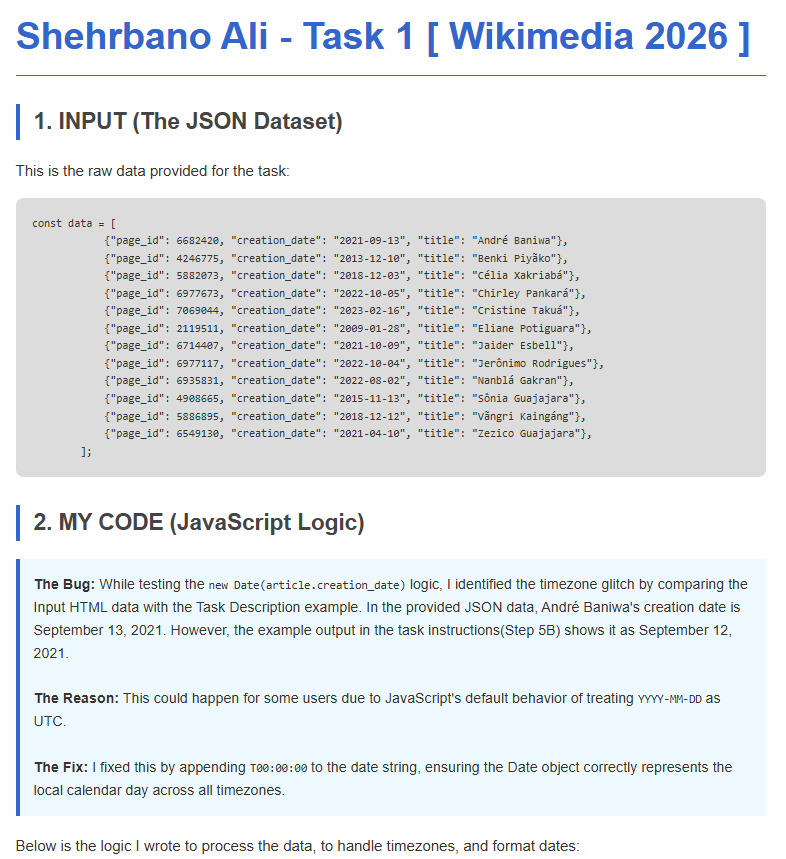
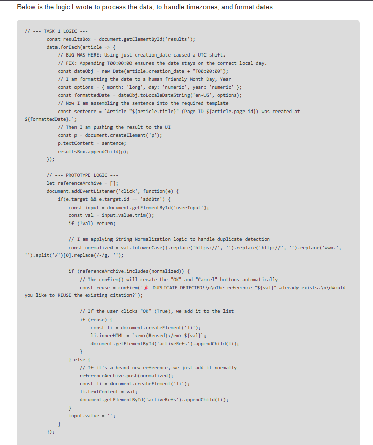
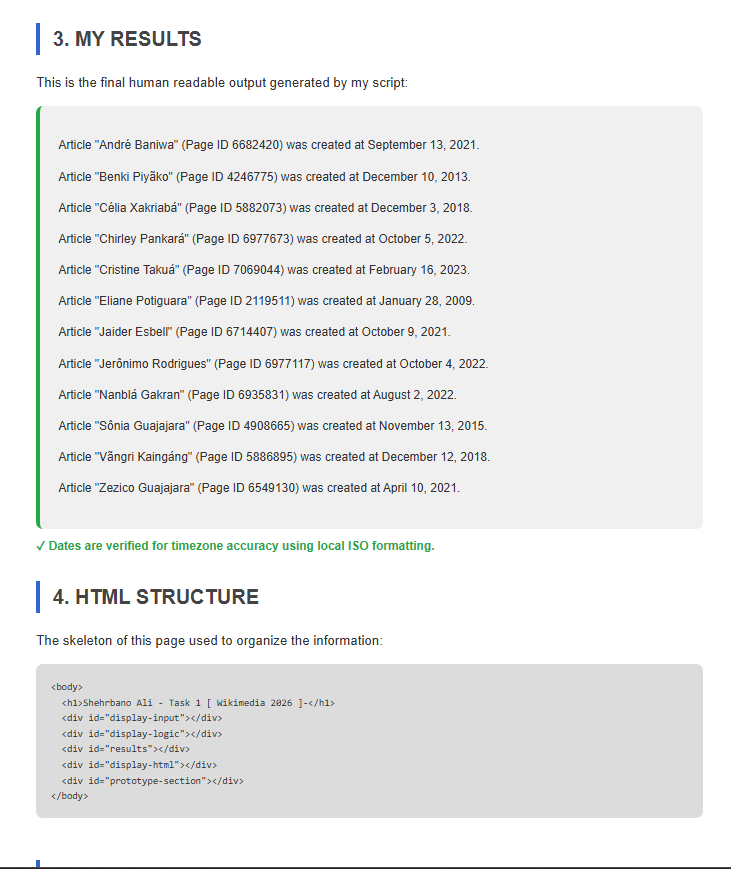
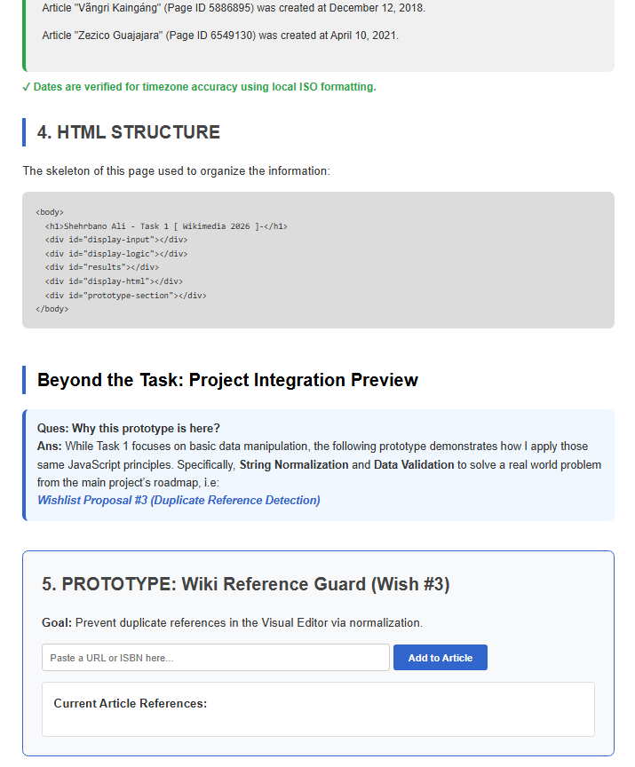

# Shehrbano Ali - Wikimedia Task 1 Submission  

**Contributor:** Shehrbano Ali  
**Email:** shehrbanoali2230@gmail.com  
**Github:** [Shehrbaano-Ali](https://github.com/Shehrbaano-Ali/)  
**Program:** Outreachy 2026 Cohort  
**Project:** Addressing the Lusophone technological wishlist proposals  
**Date:** April 5, 2026  
**Task:** [Task 1 - Create a JavaScript script to manipulate a JSON object](https://phabricator.wikimedia.org/T418285)


---
## LINK

### 🌐 [Click here to view the Live Prototype & Logic](https://shehrbaano-ali.github.io/Outreachy-Wikimedia-Task-1-JavaScript-Script/)

---
## 📸 Visual Overview

### 1. Bug Discovery & Technical Documentation
Identifying the timezone discrepancy between raw JSON data and task instructions.



### 2. Implementation Logic
Full JavaScript logic used for parsing data and handling timezone aware formatting.



### 3. Task Results & Structure
The final human readable output and underlying HTML skeleton.



### 4. Project Integration: Wiki Reference Guard
A functional prototype for Wishlist Proposal #3, utilizing String Normalization.




---
## Table of Contents
- [Introduction](#introduction)
- [Objectives](#objectives)
- [Implementation Details](#implementation-details)
- [The Timezone Challenge (Bug Fix)](#the-timezone-challenge-bug-fix)
- [Beyond the Task: Project Integration](#beyond-the-task-project-integration)
- [Key Findings](#key-findings)
- [Repository Structure](#repository-structure)
- [AI Usage](#ai-usage)
---
## Introduction
This repository contains my submission for **Task 1** of the Outreachy 2026 contribution period for Wikimedia. The core task involved manipulating a JSON dataset of articles and displaying them in a human readable format.

By cross referencing the instructions with the raw data, I identified and resolved a technical discrepancy related to browser side date rendering. Additionally, I have included a functional prototype of a **Wiki Reference Guard** to demonstrate how the principles of normalization apply to real-world Wikimedia software challenges.


---
## Objectives
1. **Parse JSON metadata** (`page_id`, `creation_date`, `title`).
2. **Format ISO dates** into localized, human-friendly strings.
3. **Resolve the "Previous Day" bug** caused by JavaScript's default UTC handling.
4. **Implement String Normalization** to prevent duplicate citations in the Visual Editor.
5. **Document findings** with a professional, developer-first presentation.

---
## Implementation Details
The solution is implemented using **Vanilla JavaScript**, **HTML5**, and **CSS3**. It avoids external libraries to remain lightweight and easily auditable by the Wikimedia community.

---
## The Timezone Challenge (Bug Fix)
During validation, I identified a logic error in the task instructions by comparing the input data with the expected output.

* **The Bug:** In the JSON, André Baniwa's date is **Sept 13**. The instruction example showed **Sept 12**.
* **The Reason:** JavaScript's `new Date(YYYY-MM-DD)` defaults to UTC. In timezones behind UTC (like the Americas), this "shifts" the date back by one day.
* **The Fix:** I appended `T00:00:00` to the string, ensuring the date represents the local calendar day regardless of the user's location.

```javascript
// FIX: Appending T00:00:00 ensures the date stays on the correct local day.
const dateObj = new Date(article.creation_date + T00:00:00);
```

---
## Beyond the Task: Project Integration
While Task 1 focuses on data manipulation, the **Wiki Reference Guard** prototype demonstrates the application of **String Normalization** to solve a real-world problem:  
_**[Wishlist Proposal #3 (Duplicate Reference Detection)](https://meta.wikimedia.org/wiki/Lista_de_desejos_tecnol%C3%B3gicos_da_lusofonia/2025/Propostas/Verificar_automaticamente_uma_refer%C3%AAncia_duplicada)**_


By stripping protocols (`https://`), prefixes (`www.`), and trailing slashes, the system can identify that two different URLs actually point to the same source, preventing citation clutter.

---
## Key Findings
* **Edge Case Awareness:** Technical documentation must account for browser specific behaviors like UTC date parsing.
* **Data Integrity:** Comparing raw inputs against expected results is the first step in robust quality assurance.
* **Scalability:** Small logic tasks (like Task 1) provide the foundational blocks for larger system features (like the Reference Guard).

---
## Repository Structure
```
Outreachy-Wikimedia-Task-1/
│
├── index.html # Core logic, UI, and functional prototype
├── README.md # Analytical documentation (this file)
├── LICENSE # MIT License
├── 01-bug-discovery.png # Screenshot: Bug analysis
├── 02-javascript-logic.png # Screenshot: Code implementation
├── 03-results-and-html.png # Screenshot: Output preview
└── 04-prototype-guard.png # Screenshot: Wishlist #3 Prototype
```

---
## AI Usage
I utilized Chatgpt for:
* **Documentation Structure:** Organizing this README to reflect the systematic analysis expected in open-source contributions.

All code, logic, and experiments were manually verified and implemented by me. The chatgpt served as a guide to accelerate understanding.

---

*Here is the link to my _**[Blog](https://shehrbanoali.hashnode.dev/beyond-the-formatter-how-a-simple-json-task-taught-me-the-weight-of-global-data-integrity)**_*  
*This work is submitted for the Outreachy 2026 internship application for the Wikimedia Project.*  
*~Shehrbano Ali*
